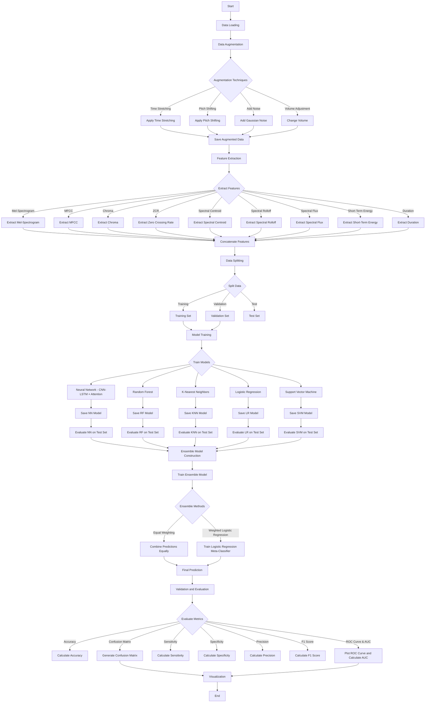

# Truora - CBU5201 Mini Project

## Table of Contents

- [Introduction](#introduction)
- [Author](#author)
- [Problem Description](#problem-description)
- [Methodology](#methodology)
  - [Pipeline Overview](#pipeline-overview)
- [Dataset](#dataset)
- [Experiments and Results](#experiments-and-results)
- [Conclusion](#conclusion)
- [References](#references)
- [Repository](#repository)
- [License](#license)

## Introduction

Truora aims to develop a machine learning-based system to detect deception in narrated stories. By analyzing audio features from recordings lasting 3 to 5 minutes, the project seeks to accurately classify each story as either **True** or **Deceptive**. This capability has significant applications in security, law enforcement, psychology, and human-computer interactions.

## Author

**Student Name**: Zheyun Zhao  
**Student ID**: 221170559  
**GitHub Repository**: [Truora](https://github.com/CharlesZZY/Truora)

## Problem Description

### Objective

The primary objective is to create a binary classification model that determines the authenticity of narrated stories. This involves distinguishing between true stories and deceptive narratives by extracting and analyzing various acoustic features from audio recordings.

### Importance

Detecting deception in verbal communication is crucial for numerous fields, including security and psychology. Audio-based analysis leverages prosodic features like intonation and pauses, offering richer insights compared to text-based methods.

## Methodology

### Pipeline Overview

The project's workflow follows a structured pipeline to process data, extract features, train models, and evaluate performance. Below is a visual representation of the entire process:

**Flowchart Explanation:**

1. **Data Loading**: Import original audio files and associated metadata.
2. **Data Augmentation**: Enhance the dataset's diversity using techniques like time stretching, pitch shifting, noise addition, and volume adjustment.
3. **Feature Extraction**: Extract acoustic features such as Mel-Spectrogram, MFCC, Chroma, ZCR, Spectral Centroid, Spectral Rolloff, Spectral Flux, Short-Term Energy, and Duration.
4. **Data Splitting**: Divide the dataset into training, validation, and test sets to ensure model generalization.
5. **Model Training**: Train multiple machine learning models, including Neural Networks (CNN-LSTM with Attention), Random Forests, K-Nearest Neighbors, Logistic Regression, and Support Vector Machines.
6. **Ensemble Model Construction**: Combine the predictions from individual models using equal weighting and Logistic Regression-based weighting to improve overall accuracy.
7. **Validation and Evaluation**: Assess model performance using metrics like Accuracy, Confusion Matrix, Sensitivity, Specificity, Precision, F1 Score, and ROC AUC.

## Dataset

### Overview

The project utilizes the **CBU5201 Deception Dataset**, comprising:

- **Original Data**: 100 audio recordings (3-5 minutes each) with metadata on Language and Story Type.
- **Augmented Data**: 400 augmented samples generated using time stretching, pitch shifting, noise addition, and volume adjustment.
- **Total Samples**: 500 (100 original + 400 augmented).

### Data Splitting

- **Training Set**: 70% of the data (~350 samples)
- **Validation Set**: 15% of the data (~75 samples)
- **Test Set**: 15% of the data (~75 samples)

## Experiments and Results

### Models Evaluated

1. **Neural Network (CNN-LSTM with Attention)**
   - **Accuracy**: 44%
   - **Sensitivity**: 88%
   - **Specificity**: 6%
   - **AUC**: 0.46

2. **Random Forest Classifier**
   - **Accuracy**: 44%
   - **Sensitivity**: 45%
   - **Specificity**: 44%
   - **AUC**: 0.48

3. **K-Nearest Neighbors (KNN) Classifier**
   - **Accuracy**: 42%
   - **Sensitivity**: 45%
   - **Specificity**: 40

%
   - **AUC**: 0.42

4. **Logistic Regression (LR) Classifier**
   - **Accuracy**: 56%
   - **Sensitivity**: 69%
   - **Specificity**: 44%
   - **AUC**: 0.63

5. **Support Vector Machine (SVM) Classifier**
   - **Accuracy**: 66%
   - **Sensitivity**: 93%
   - **Specificity**: 42%
   - **AUC**: 0.67

### Ensemble Models

- **Equal-Weight Ensemble (1:1:1:1:1)**
  - **Accuracy**: 59%
  - **Sensitivity**: 79%
  - **Specificity**: 42%
  - **AUC**: 0.57

- **Logistic Regression–Based Weighted Ensemble**
  - **Accuracy**: 53%
  - **Sensitivity**: 69%
  - **Specificity**: 40%
  - **AUC**: 0.59
  - **Model Weights**:
    - Logistic Regression: 0.4381
    - Random Forest: 0.3218
    - KNN: 0.1221
    - SVM: 0.1144
    - Neural Network: 0.0035

### Insights

- **Logistic Regression** and **Random Forest** contributed most significantly to the ensemble's performance.
- **Neural Network** had minimal impact, suggesting underperformance or overfitting.
- The ensemble approach improved sensitivity but maintained moderate specificity.

## Conclusion

The project successfully established an end-to-end pipeline for deception detection in narrated stories using machine learning. Key takeaways include:

1. **Rich and Diverse Feature Engineering**  
   Comprehensive audio feature extraction is crucial but may require further refinement.

2. **Comparative Performance of Multiple Models**  
   - **Neural Network (CNN-LSTM + Attention)**: Though it has high capacity for complex data, it may have overfit or suffered from insufficient tuning in this study, resulting in limited true-story recognition.
   - **Random Forest, KNN, Logistic Regression, SVM**: Each model demonstrated distinct strengths and vulnerabilities in handling deceptive vs. true stories. SVM (RBF kernel) tended to perform better, capturing non-linear class boundaries, whereas Logistic Regression offered interpretability at the expense of capturing fewer complex patterns.

3. **Ensemble Methods and Weight Learning**  
   - **Equal-Weight Averaging (1:1:1:1:1)**: Provided a modest improvement over weaker individual models but could not fully capitalize on the stronger ones.
   - **Logistic Regression–Based Stacking**: Automatically learned model-specific weights, favoring certain stronger models (RF, LR) while almost ignoring weaker ones (NN). The final accuracy and AUC improved only marginally, suggesting that further feature engineering and hyperparameter optimization remain crucial.

4. **Practical Implications and Future Work**  
   - **Scalability and Generalization**: A larger and more diverse dataset is paramount for training more robust models and reducing bias.
   - **Enhanced Feature Extraction**: Additional spectral or temporal features (e.g., voice quality measures) or multimodal input (video, physiological signals) could bolster detection of subtle deceptive signals.
   - **Algorithmic Optimization**: Thorough hyperparameter searches and cross-validation strategies can further improve classification boundaries.
   - **Real-World Validation**: Live testing across diverse language and accent groups would validate the model’s reliability in practical scenarios.

## References

1. **McFee, B. et al. (2015).** *librosa: Audio and music signal analysis in python.* Proceedings of the 14th Python in Science Conference, 18–25.  
   <https://librosa.org/doc/latest/>

2. **Pedregosa, F. et al. (2011).** *Scikit-learn: Machine learning in Python.* Journal of Machine Learning Research, 12, 2825-2830.  
   <https://scikit-learn.org/>

3. **Chollet, F. (2015).** *Keras.*  
   <https://keras.io/>

4. **Waskom, M. L. (2021).** *seaborn: statistical data visualization.* Journal of Open Source Software, 6(60), 3021.  
   <https://seaborn.pydata.org/>

5. **da Costa, F. R. (2021).** *TQDM: A fast, extensible progress bar for Python and CLI.*  
   <https://tqdm.github.io/>

6. **Pedregosa, F. et al. (2011).** *Joblib: Lightweight pipelining with Python.* Journal of Machine Learning Research, 12, 2825-2830.  
   <https://joblib.readthedocs.io/>

7. **Bouvier, N. et al. (2020).** *SoundFile: An audio library based on libsndfile.*  
   <https://pysoundfile.readthedocs.io/>

## Repository

Access the full project, including source code, data processing scripts, and trained models, at the [Truora GitHub Repository](https://github.com/CharlesZZY/Truora).

## License

This project is licensed under the [MIT License](LICENSE).